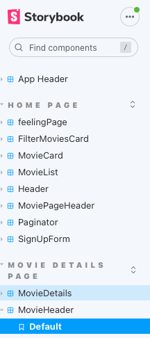

# Assignment 1 - ReactJS app.

Name: Dominik Wawak

## Overview.

This is a classic react project that clones the popular move websites such as imdb, netflix and many others.

### Features.
 
+ Sign up and login with authentication from login base, inluding an auth context ensuring the user is logged in.
+ Trending movies are scrolled across the homepage.
+ Movie details now show the movie cast which is searchable.
+ Movie details also show the youtube trailer preview.
+ Sorting by most popular is implemented in the filter card.
+ Favourite movies and reviews are stored in firebase.
+ Paginiation on the movie pages with chaching support.
+ Feeling lucky page that will make you select a random trending show to watch.
+ A dashboard where you can update your email, log out and see your reviews.
+ Neater styling with MaterialUI, bootstrap and css.
+ Overall responsive UI

## Setup requirements.

you probably have to install firebase and bootstrap.

```sh
$ npm install firebase
$ npm install bootstrap

```

If you would like to connect this app to your own firebase database, please edit the firebase.js file and add in your own configuration.
Don't worry you don't need to hide firebase api keys as you can set firebase security rules in the console.


## API endpoints.

+ Youtube trailer link - https://api.themoviedb.org/3/movie/${id}/videos
+ Movie posters for carousel - https://image.tmdb.org/t/p/original/${movie.backdrop_path}
+ Movie Credits - https://api.themoviedb.org/3/movie/${id}/credits
+ Trending shows of the day - https://api.themoviedb.org/3/trending/tv/day
+ Trending movies for the day - https://api.themoviedb.org/3/trending/all/day

## App Design.

### Component catalogue.

The below screenshot shows my story book, It does not reflect on all of my features as I have not focused heavily on stroybook.


## UI Design.

### Homepage


>Shows the nice big back-drop of the most trending movies to entice users to watch a movie.


>The image above shows the nice clean movie display-like-poster. My idea was to gave a movie gallery like display and the user can hover over any image and see the details. 


>The paginator is added wuth caching support from react query paginaton.

### Move Details Page


> Youtube trailer is the first thing that shows up on the movie details page.


>Then there is some details on the movie and the cast of the move as well as a search bar to search the actors.

### SignUp and Dashboard


> The sign up page creates a user and saves the user in firebase. The log in page is simmilar.


> The dashboard is the page the user goes to when he or she is logged on. It allows the user to update an email. And also allows the user to view his or her reviews. 

### Feeling lucky page


> This page is a very fast auto scrolling carousel that stops when the user mouse enters. Therefore acting as a spinning wheel for the user to choose a tv show to start watching.


### Routing.

+ /signUp - shows the sign up page
+ /logIn - shows the log in page
+ /feelinglucky - random tv show picker
+ /forgotPassword - reset password page
+ /updateProfile -update progile page
+ /Dashboard - page that shows the user reviews


The movie/favourites route is Private as the favourite movies are stored in the users database.
The Dashboar and updateProfile routes are also private as they require the user to be logged in.
## Independent learning.

+ Firebase integration - mainly the Docs as the firebase version changes, some past knowledge:
https://firebase.google.com/docs/web/modular-upgrade
https://www.youtube.com/watch?v=PKwu15ldZ7k&t=1631s


+ Bootstrap and css styling :
    https://www.w3schools.com/howto/howto_css_display_element_hover.asp
    https://www.youtube.com/watch?v=AYhBXn2IlKA


